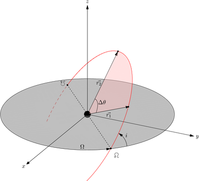
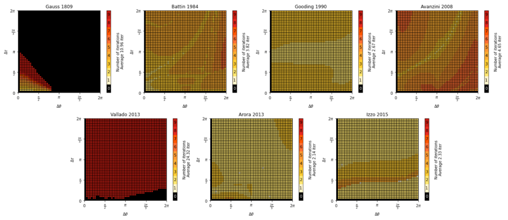
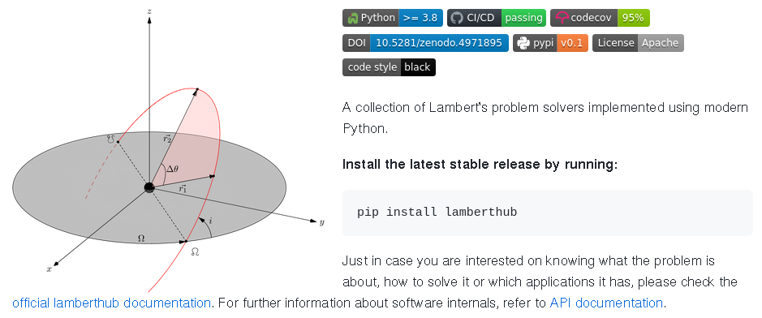
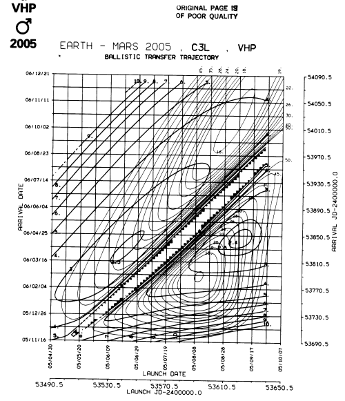
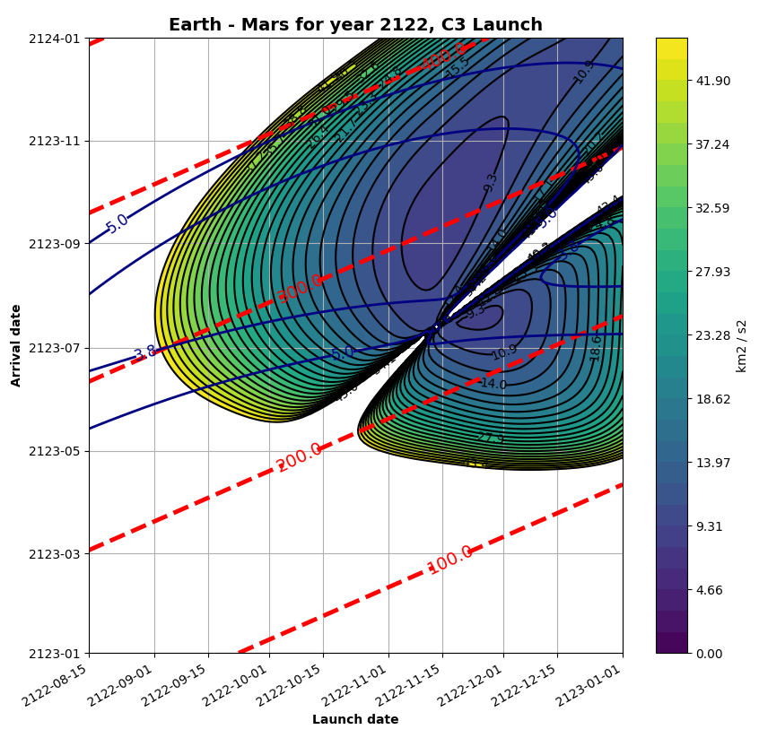

# How to organize SciPyConf Mars Edition

A SciPyConf lightning talk by Jorge Martínez :zap:
https://jorgemartinez.space/

---
# It's year 2123 and ...


* SciPyConf is hosted in Mars.
* How do we get there?
* Which is the best date for SciPyConf Mars? :thinking:
---

# Lambert's problem :memo:

I want to go from $\vec{r_1}$ to $\vec{r_2}$ in a given $\Delta t$.


$$
\begin{equation*}
    \ddot{\vec{r}} = -\frac{\mu}{r^3}\vec{r}\quad
    \begin{cases}
       \vec{r}\;(t_1) = \vec{r_1}\\
       \vec{r}\;(t_2) = \vec{r_2}\\   
    \end{cases}
\end{equation*}
$$

What orbit should I use, mom? :thinking:



---
# There are lots of algorithms out there! :books:

---


---

# lamberthub: a hub of Lambert's problem solvers


---


---

# Cool! We already know how to go to Mars :rocket:
* Now the question is...

---

# When should we go to Mars?
* Porkchops to the rescue!
* Yeah, we have those in **poliastro**, no worries :wink:

---


---

# What are porkchops?

* Range of launch and arrival dates.
* For all combiations of launch and arrival date, $\Delta t$
* Solve Earth's position at launch, $\vec{r_1}$
* Solve Mars position at arrival, $\vec{r_2}$
* Solve Lambert's problem.
 


---

# Porkchops with poliastro

```python
from astropy import units as u

from poliastro.bodies import Earth, Mars
from poliastro.plotting.porkchop import PorkchopPlotter
from poliastro.util import time_range

# Select a range of launch and arrival dates
launch_span = time_range("2122-08-15", end="2123-01-01", periods=150)
arrival_span = time_range("2123-01-01", end="2124-01-01", periods=150)

# Generate the porkchop
porkchop_plot = PorkchopPlotter(Earth, Mars, launch_span, arrival_span)
dv_dpt, dv_arr, c3dpt, c3arr, tof = porkchop_plot.porkchop()
```

---

# Porkchop figure for SciPyConf in year 2123

---
# Please, do not forget your Martian ESTA approval

* You launch in November 2122 and wait 300 days.
* You launch in December 2122 and wait 250 days.
* You are Texan and launch whenever you want.



---

# Thank you all for this amazing community! :star:

---
